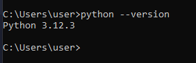
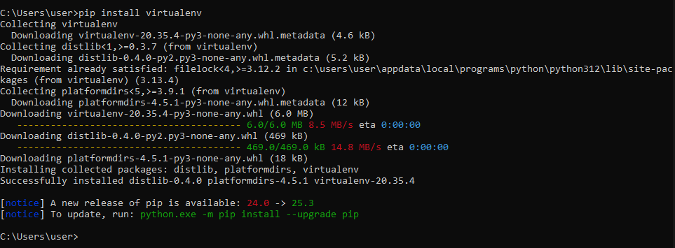
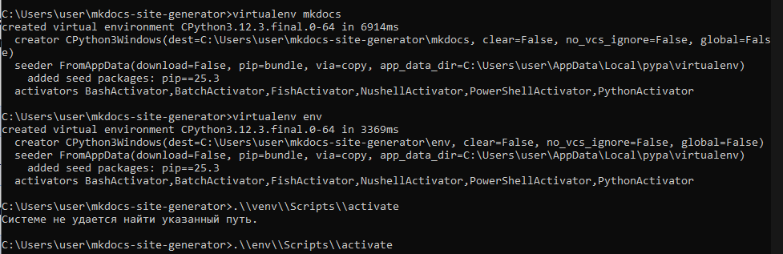
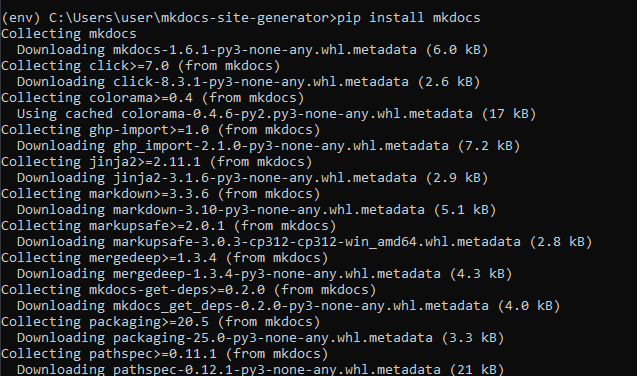
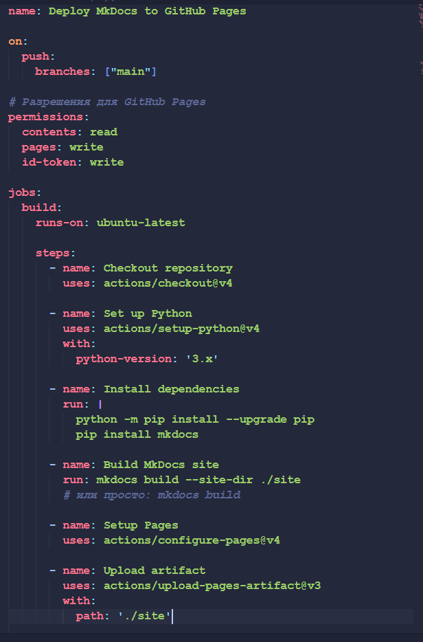

# Текстовый отчет с демонстрацией выполненных действий для развертывания

### 1. Устанавливаем Python актуальной версии

### 2. Устанавливаем virtualenv

### 3. Создаем каталог и там развертываем виртуальное окружение, активируем его

### 4. Ставим mkdocs

### 5. Настраиваем GitHub Actions
